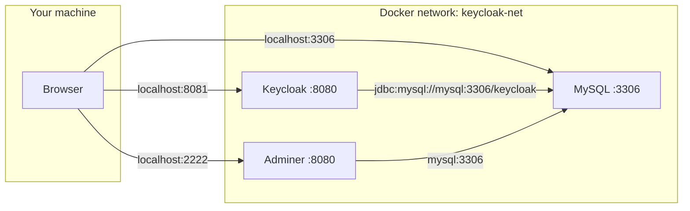

# Keycloak + MySQL (Docker)

A ready-to-run local development environment for **Keycloak** (login and identity management), **MySQL** (database), and **Adminer** (simple database browser).

Use this guide whether you are running it for the first time or tuning it for your own setup.

---

## Table of contents

1. [What is this?](#what-is-this) — start here if you are new
2. [Before you begin](#before-you-begin)
3. [First-time setup (step by step)](#first-time-setup-step-by-step)
4. [Open the apps in your browser](#open-the-apps-in-your-browser)
5. [Quick reference](#quick-reference) — URLs and passwords at a glance
6. [Day-to-day commands](#day-to-day-commands)
7. [Configuration (`.env.example`)](#configuration-envexample)
8. [Going further](#going-further) — realms, themes, external tools
9. [How it works](#how-it-works) — architecture for advanced users
10. [Troubleshooting](#troubleshooting)
11. [Glossary](#glossary)

---

## What is this?

This folder starts three Docker containers that work together:

| What you get | What it does | Open in browser |
|--------------|--------------|-----------------|
| **Keycloak** | Manages users, logins, and access for your apps | http://localhost:8081 |
| **MySQL** | Stores Keycloak data (users, realms, settings) | — (use Adminer or a DB tool) |
| **Adminer** | Simple web UI to view and query the database | http://localhost:2222 |

You do **not** need to install Keycloak or MySQL on your machine. Docker runs everything in isolated containers.

**Good for:** local development, learning Keycloak, testing login flows.

**Not for:** production — passwords are simple defaults and Keycloak runs in dev mode.

---

## Before you begin

### Install Docker

You need **Docker** and **Docker Compose** (included with Docker Desktop on Mac/Windows).

Verify installation:

```bash
docker --version
docker compose version
```

Both commands should print a version number. If not, install Docker first:
- https://docs.docker.com/get-docker/

### Know where the files are

All commands in this README assume you are inside this folder:

```bash
cd iam/keycloak
```

Docker Compose reads variables from **`.env.example`** via `--env-file .env.example` (Compose does not load `.env.example` automatically). Every `docker compose` command below includes that flag.

---

## First-time setup (step by step)

### Step 1 — Review settings (optional)

Open `.env.example` in this folder. It holds Docker-related passwords and ports. The defaults work out of the box for local dev — you can skip editing for now.

### Step 2 — Create optional folders

These are only needed if you plan to import realms or custom themes:

```bash
mkdir -p keycloak/import keycloak-themes
```

### Step 3 — Start everything

```bash
docker compose --env-file .env.example up -d
```

What this does:
- Downloads images on first run (may take a few minutes)
- Starts MySQL, waits until it is healthy
- Then starts Keycloak and Adminer

### Step 4 — Wait for Keycloak

Keycloak is slow on **first** startup (about 1–2 minutes). It creates database tables in MySQL.

Check progress:

```bash
docker compose --env-file .env.example ps
```

You want all three services **Up**. MySQL should show **healthy**.

Watch Keycloak logs until you see `Listening on`:

```bash
docker logs -f keycloak-docker-mysql
```

Press `Ctrl+C` to stop watching logs (containers keep running).

### Step 5 — Confirm it works

Open http://localhost:8081 in your browser. You should see the Keycloak welcome page.

---

## Open the apps in your browser

### Keycloak admin console

1. Go to http://localhost:8081/admin
2. Click **Administration Console**
3. Log in:

| Field    | Value   |
|----------|---------|
| Username | `admin` |
| Password | `admin` |

From here you can create **realms** (isolated login spaces), **users**, **clients** (your apps), and **roles**.

> **New to Keycloak?** A *realm* is like a tenant. The default `master` realm is for administration. Create a separate realm (e.g. `my-app`) for your application users.

### Adminer (browse the database)

1. Go to http://localhost:2222
2. Fill in the login form:

| Field    | Value                              |
|----------|------------------------------------|
| System   | `MySQL`                            |
| Server   | `mysql` ← must be this, not `localhost` |
| Username | `keycloak`                         |
| Password | `keycloak`                         |
| Database | `keycloak` (optional)              |

3. Click **Login**

You should see tables like `user_entity`, `realm`, etc. — that is Keycloak's data.

**Root access** (full database control): use username `root` and password `rootpassword`.

---

## Quick reference

### URLs

| Service   | URL |
|-----------|-----|
| Keycloak  | http://localhost:8081 |
| Keycloak admin | http://localhost:8081/admin |
| Adminer   | http://localhost:2222 |

### Credentials (defaults)

| Service / role      | Username  | Password       |
|---------------------|-----------|----------------|
| Keycloak admin      | `admin`   | `admin`        |
| MySQL app user      | `keycloak`| `keycloak`     |
| MySQL root          | `root`    | `rootpassword` |

### Ports

| Port  | Service |
|-------|---------|
| 8081  | Keycloak (change with `KC_PORT` in `.env.example`) |
| 2222  | Adminer (change with `MYSQL_CLIENT_PORT`) |
| 3306  | MySQL (change with `DB_PORT`) |

---

## Day-to-day commands

Run these from `iam/keycloak`:

```bash
# Start all services (background)
docker compose --env-file .env.example up -d

# See status
docker compose --env-file .env.example ps

# View logs (all services)
docker compose --env-file .env.example logs -f

# View logs (one service)
docker logs -f keycloak-docker-mysql
docker logs -f keycloak-mysql
docker logs -f keycloak-adminer

# Stop everything (data is kept)
docker compose --env-file .env.example down

# Stop and DELETE all database data (fresh start)
docker compose --env-file .env.example down -v

# Restart after changing .env.example or docker-compose.yml
docker compose --env-file .env.example up -d
```

---

## Configuration (`.env.example`)

All Docker Compose settings live in **`.env.example`**. Pass it on every compose command:

```bash
docker compose --env-file .env.example up -d
```

| Variable            | Default        | What it controls |
|---------------------|----------------|------------------|
| `DB_HOST`           | `mysql`        | MySQL hostname inside Docker (do not change unless you rename the service) |
| `DB_PORT`           | `3306`         | MySQL port on your machine |
| `DB_NAME`           | `keycloak`     | Database name |
| `DB_USERNAME`       | `keycloak`     | MySQL user Keycloak connects with |
| `DB_PASSWORD`       | `keycloak`     | Password for that user |
| `DB_ROOT_PASSWORD`  | `rootpassword` | MySQL superuser password |
| `MYSQL_CLIENT_PORT` | `2222`         | Adminer port on your machine |
| `KC_PORT`           | `8081`         | Keycloak port on your machine |
| `KC_ADMIN`          | `admin`        | Keycloak admin username |
| `KC_ADMIN_PASSWORD` | `admin`        | Keycloak admin password |

After editing `.env.example`:

```bash
docker compose --env-file .env.example up -d
```

> **Tip:** If port `8081` or `2222` is already used on your machine, change `KC_PORT` or `MYSQL_CLIENT_PORT` to a free port (e.g. `8082`, `3333`).

> **Optional local overrides:** To keep personal values out of git, create a gitignored `.env` and pass both files (later files win): `docker compose --env-file .env.example --env-file .env up -d`

---

## Going further

### Import a Keycloak realm

A realm export is a JSON file with users, clients, and settings.

1. Place `.json` files in `keycloak/import/`
2. Restart Keycloak:

```bash
docker compose --env-file .env.example restart keycloak
```

Keycloak imports files from that folder on startup (`--import-realm` flag).

### Custom Keycloak themes

Put theme files in `keycloak-themes/`. They are mounted into the container at `/opt/keycloak/themes`.

### Connect with an external database tool

Prefer a desktop app over Adminer? Use **DBeaver**, **MySQL Workbench**, or **TablePlus** with:

| Field    | Value       |
|----------|-------------|
| Host     | `localhost` |
| Port     | `3306`      |
| Database | `keycloak`  |
| Username | `keycloak`  |
| Password | `keycloak`  |

CLI (if `mysql` client is installed):

```bash
mysql -h 127.0.0.1 -P 3306 -u keycloak -p keycloak
# password: keycloak
```

### Connect your application to Keycloak

Typical settings for a local app:

| Setting        | Value |
|----------------|-------|
| Auth server    | http://localhost:8081 |
| Realm          | your realm name (e.g. `master` or one you created) |
| Client ID      | created in Keycloak admin console |

Create a client in **Clients → Create client** in the admin console.

---

## How it works

For users who want to understand the plumbing.

### Architecture



### Startup order

1. **MySQL** starts and runs a health check (`mysqladmin ping`)
2. **Keycloak** and **Adminer** wait until MySQL is healthy (`depends_on`)
3. **Keycloak** runs Liquibase migrations to create/update its schema
4. **Keycloak** listens on port 8080 inside the container (mapped to `KC_PORT` on your host)

### Containers and images

| Service   | Image                              | Container name          |
|-----------|------------------------------------|-------------------------|
| MySQL     | `mysql:8.4`                        | `keycloak-mysql`        |
| Keycloak  | `quay.io/keycloak/keycloak:26.6.2` | `keycloak-docker-mysql` |
| Adminer   | `adminer:4`                        | `keycloak-adminer`      |

### Volumes

| Mount | Purpose |
|-------|---------|
| `mysql_data` (Docker volume) | Persists database across restarts |
| `./keycloak/import` | Realm JSON files for import |
| `./keycloak-themes` | Custom UI themes |

### Dev mode vs production

Keycloak runs with `start-dev`, which:
- Enables HTTP (no HTTPS setup)
- Disables strict hostname checks
- Rebuilds on startup (slower, but convenient)

For production, use `start` with proper hostname, TLS, and stronger secrets — not this compose file as-is.

### Why Adminer uses server `mysql`, not `localhost`

Inside Docker, each container has its own `localhost`. The name `mysql` is the Docker service name and resolves to the MySQL container on the internal network. `ADMINER_DEFAULT_SERVER` in compose pre-fills this for you.

---

## Troubleshooting

### "Nothing happens" / page won't load

1. Check containers are running:

```bash
docker compose --env-file .env.example ps
```

2. If Keycloak is `Up` but the page fails, wait longer on first boot and check logs:

```bash
docker logs keycloak-docker-mysql | tail -20
```

### MySQL is unhealthy / Keycloak won't start

View MySQL logs:

```bash
docker logs keycloak-mysql
```

**Nuclear option** — wipe the database and start fresh:

```bash
docker compose --env-file .env.example down -v
docker compose --env-file .env.example up -d
```

> This deletes all Keycloak users and realms stored in MySQL.

### Port already in use

Error like `bind: address already in use`.

Edit `.env.example` and change the conflicting port:

```env
KC_PORT=8082
# or
MYSQL_CLIENT_PORT=3333
```

Then:

```bash
docker compose --env-file .env.example up -d
```

### Adminer shows 403 or "can't connect"

- **Server** must be `mysql`, not `db` or `localhost`
- **System** must be `MySQL`
- Check MySQL is healthy: `docker compose --env-file .env.example ps`

### Wrong password / access denied

Credentials come from `.env.example`. If you changed `.env.example` **after** the first `docker compose up`, the old passwords may still be in the `mysql_data` volume. Either:
- Use the original passwords, or
- Reset: `docker compose --env-file .env.example down -v && docker compose --env-file .env.example up -d`

### Keycloak admin login fails

Default is `admin` / `admin` from `KC_ADMIN` and `KC_ADMIN_PASSWORD` in `.env.example`. These are set on **first** bootstrap only. If you already started Keycloak with different values, either use those or reset the volume.

### Docker command not found

Install Docker: https://docs.docker.com/get-docker/

---

## Glossary

| Term | Meaning |
|------|---------|
| **Container** | A running instance of an app, packaged by Docker |
| **Docker Compose** | Tool to start multiple containers from `docker-compose.yml` |
| **Keycloak** | Open-source identity server — handles login, SSO, users, roles |
| **Realm** | A Keycloak namespace for users and apps (like a tenant) |
| **Client** | An application registered to use Keycloak for login |
| **MySQL** | Relational database storing Keycloak's data |
| **Adminer** | Lightweight web UI for browsing MySQL |
| **`.env.example`** | Docker Compose variables (passwords, ports); pass with `--env-file .env.example` |
| **Volume** | Persistent storage that survives container restarts |
| **Dev mode** | Keycloak's relaxed local-development configuration |

---

## File layout

```
iam/keycloak/
├── docker-compose.yml   # Defines MySQL, Keycloak, Adminer
├── .env.example         # Docker Compose passwords and ports
├── README.md            # This file
├── keycloak/
│   └── import/          # Realm JSON files (optional)
└── keycloak-themes/     # Custom themes (optional)
```

---

**Need help?** Start with [First-time setup](#first-time-setup-step-by-step), then [Troubleshooting](#troubleshooting). For deeper changes, see [Going further](#going-further) and [How it works](#how-it-works).
